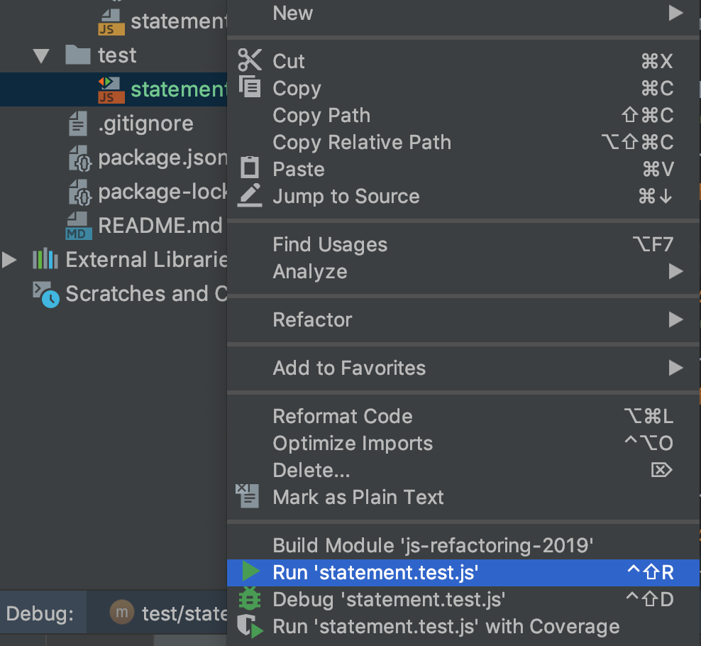
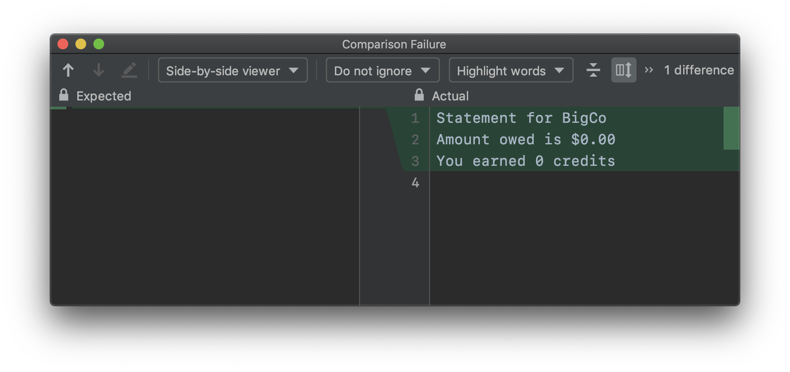
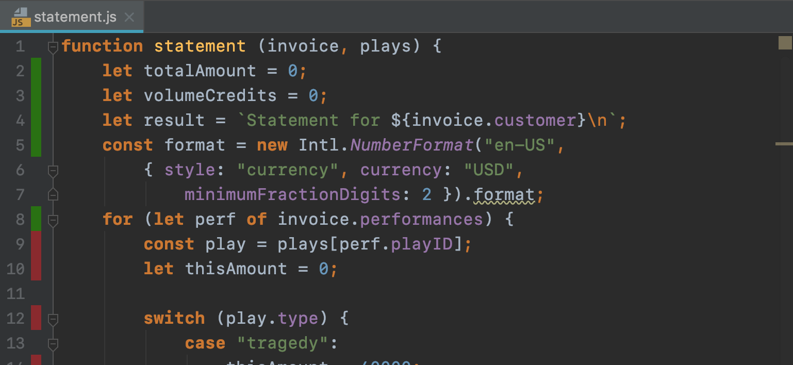
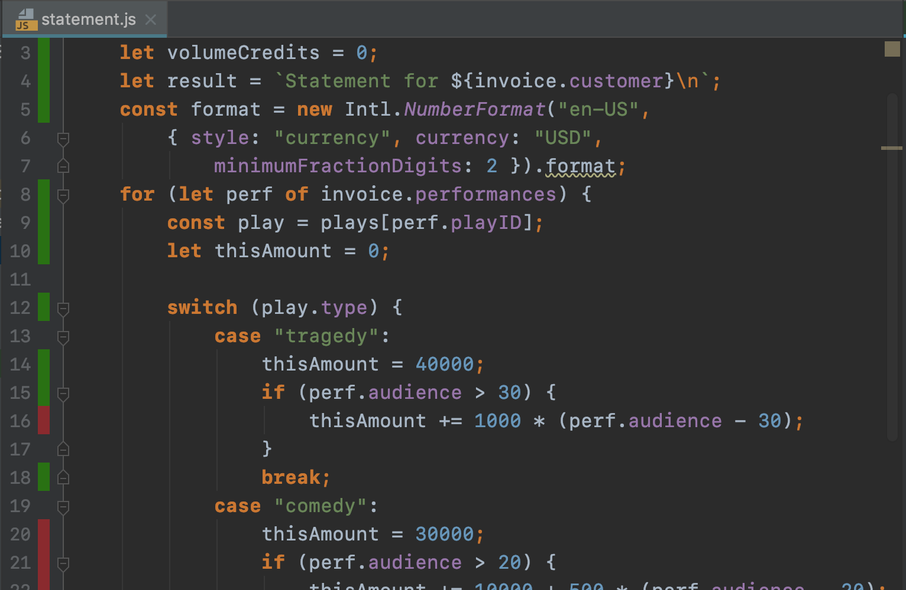
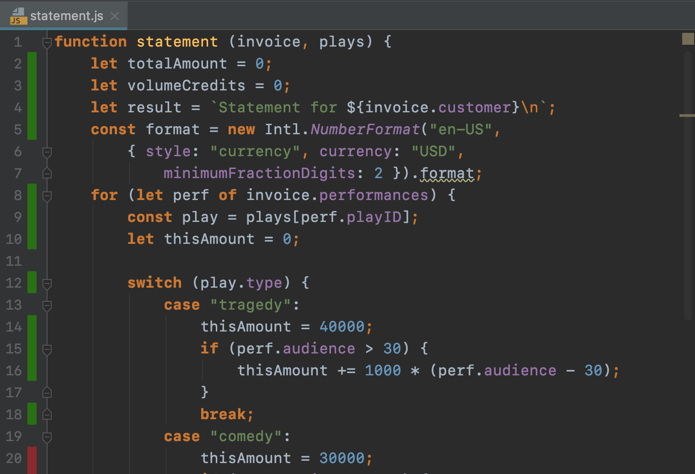
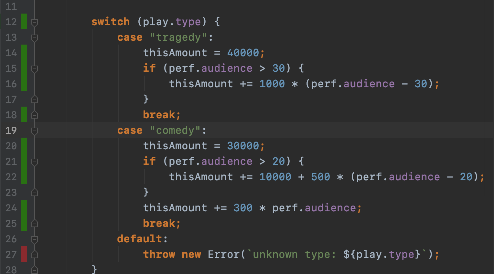

# Part2. Characterization Test 작성 

지금부터 우리는 `statement` 코드를 리팩토링 하려 합니다.  
하지만 해당 코드의 동작을 정확히 알지 못하는 상황이기에 바로 리팩토링 할 수가 없습니다.  
적어도 리팩토링을 하려면 그 과정에서 버그가 발생하진 않았는지를 검증할 테스트가 꼭 필요합니다. 이럴 땐 __Characterization Test__ 를 사용할 수 있습니다.  

## Characterization Test 란?
일반적으로 우리가 작성하는 테스트는 이미 동작을 알고 있는 코드가 제대로 작동하는지 검증하기 위해 사용됩니다.  
하지만, 지금과 같이 정확한 동작을 모르는 코드를 수정 해야 할 때도 테스트 코드를 사용할 수 있는데 그게 바로 Characterization Test 입니다.  
__Characterization Test 는__ 일반적인 테스트와 다르게 동작의 옳고 그름을 검증하는 게 아니라 __동작 그 자체를 이해하기(Characterize the code's behavior) 위해 사용하는 테스트__ 입니다.

> When we write characterization tests we build up our knowledge of what the code actually does. This is particularly useful when we want to refactor or rewrite. We can run our tests and find out immediately whether we’ve changed behavior -Michael Feathers, [About Characterization Testing](https://michaelfeathers.silvrback.com/characterization-testing)

## statement.js 도메인 설명

우리가 리팩토링 할 `statement` 는 `invoice` 와 `plays` 정보를 이용하여 Bill 정보를 출력하는 함수입니다. 아래 내용은 해당 입력과 출력에 대한 샘플 데이터입니다.

plays:
```json
{
  "hamlet": {"name": "Hamlet", "type": "tragedy"},
  "asLike": {"name": "As You Like It", "type": "comedy"}
}
```

invoice:
```json
{
  "customer": "BigCo",
  "performances": [
    {
      "playID": "hamlet",
      "audience": 20
    },
    {
      "playID": "asLike",
      "audience": 15
    }
  ]
}
```
이제 시작해봅시다.

## 잠깐! 테스트에 필요한 패키지를 설치하셨나요?

package.json
```json
"devDependencies": {
  "mocha": "^6.1.2",  // Javascript Test Framework 패키지
  "nyc": "^13.3.0"    // coverage 툴인 istanbul 의 CLI 패키지
}
```
```console
npm install
```

---

## Step1. Trivial test
먼저 테스트 파일을 생성하고 실행 환경이 준비되었는지 확인하기 위해 가장 기본적인 테스트를 하나 추가합니다.  
`test/statement.test.js`  
```js
const assert = require('assert');
const statement = require('../src/statement');

describe('statement', () => {
  it('trivial', () => {
    assert("", "");
  });
});
```
### Test 실행
`statement.test.js` 파일에서 마우스 우클릭 한 후, __"Run 'statement.test.js'"__ 를 실행 합니다.  


WebStorm 에서 다시 실행하려면 `^R` 단축키를 사용하면 됩니다.

### Code Coverage 확인
`statement.test.js` 파일에서 마우스 우클릭 한 후, __"Run 'statement.test.js' with Coverage"__ 를 실행 합니다.

`statement.js` 파일을 오픈하여, Coverage 상태를 확인해 보면 아래와 같이 코드 라인 번호 옆에 색이 표시됩니다.


WebStorm에서 Actions 창을 열어 실행할 수도 있습니다.


자, 이제 기본적인 테스트 환경이 준비됐습니다.

## Step2. Test 'x' 에서부터 시작하기
어떻게 동작하는 코드인지 모르기 때문에 `'x'` 라는 임의의 이름을 가진 테스트로 시작합니다.
```js
it('x', () => {
  let invoice;
  let plays;
  const result = statement(invoice, plays);
  assert.strictEqual(result, "");
});
```
테스트를 실행하면 코드 에러가 발생합니다. 샘플 데이터를 참고해서 에러를 없애줍니다.
```js
it('x', () => {
  let invoice = {
    customer: 'BigCo',
    performances: []
  };
  let plays;
  const result = statement(invoice, plays);
  assert.strictEqual(result, "");
});
```
이제 Assertion 실패만 뜹니다. 이때의 결과 값을 복사해서 테스트의 `assert` 함수에 넣어줍니다.


```js
it('x', () => {
  let invoice = {
    customer: 'BigCo',
    performances: []
  };
  let plays;
  const result = statement(invoice, plays);
  assert.strictEqual(result, "Statement for BigCo\n" +
    "Amount owed is $0.00\n" +
    "You earned 0 credits\n");
});
```
다시 테스트를 실행해보면 당연히 테스트를 통과합니다.  
__이로써 우리는 `invoice.performances` 가 empty 인 경우에 대해 코드의 동작을 확인(Characterize) 했습니다.__  
그러니 `'x'` 였던 테스트 코드 이름도 적절한 이름으로 변경해 줍니다. 저는 `'for empty performances'` 라 하였습니다.


이 과정이 이상해 보일 수 있습니다. 하지만 우리의 목적은 코드의 동작을 검증하는 게 아니라 리팩토링에 앞서 Characterization Test로 모르는 코드를 이해하는 것입니다.

다음으로 넘어가기에 전에 Coverage를 다시 측정합니다. 이전보다 Coverage 가 늘어난 걸 확인할 수 있습니다.



## Step3. Coverage until 1st switch case
이제부터는 `statement` 코드의 Coverage를 늘려가며 점차 코드를 이해해 봅시다. 

새로운 테스트를 만들고 `statement` 의 코드를 확인하면서 에러가 발생하지 않고 첫 번째 switch case에 도달할 수 있도록 parameter(`invoice`, `plays`)를 설정합니다.

```js
it('to first switch', () => {
  let invoice = {
    customer: 'BigCo',
    performances: [
      {
        playID: 'hamlet',
        audience: 20
      },
    ]
  };
  let plays = {
    hamlet: { name: 'Hamlet', type: 'tragedy' }
  };
  const result = statement(invoice, plays);
  assert.strictEqual(result, "");
});
```
테스트를 실행해봅니다. 코드 에러 없이 테스트가 정상적으로 실행된다면 이번에도 실제 결과 값을 복사해 테스트 코드의 기댓값으로 넣어줍니다. 이때 커버리지 측정으로 테스트를 실행하면 진행 상황을 좀 더 이해하기 쉽습니다.
```js
assert.strictEqual(result, "Statement for BigCo\n" +
  "  Hamlet: $400.00 (20 seats)\n" +
  "Amount owed is $400.00\n" +
  "You earned 0 credits\n");
```
마찬가지로 테스트가 통과되는 걸 확인할 수 있습니다. 이제 코드의 동작에 대한 새로운 지식을 알게 되었으니 그에 맞게 테스트의 이름을 변경해줍니다.
```js
it('for one performance with less than 30 audience', () => {
  // ...
}
```

커버리지를 확인해보니 16 번째 라인이 남았습니다. 



해당 라인을 커버할 수 있는 Characterization Test를 추가해 커버리지를 채움과 동시에 코드에 대한 새로운 지식을 또 얻을 수 있습니다.

```js
it('for one performance with more than 30 audience', () => {
  let invoice = {
    customer: 'BigCo',
    performances: [
      {
        playID: 'hamlet',
        audience: 31
      },
    ]
  };
  let plays = {
    hamlet: { name: 'Hamlet', type: 'tragedy' }
  };
  const result = statement(invoice, plays);
  assert.strictEqual(result, "");
});
```

이제 첫번째 switch case 까지 커버리지를 모두 채웠습니다.



## Step4. Coverage until 2nd switch case

지금까지 다음의 같은 과정을 거치며 Characterization Test를 작성했습니다. 
1. 의문의 코드에 대한 테스트 추가
1. 에러 없이 목표하는 지점까지 테스트가 도달할 수 있게 수정
1. 테스트 코드 정상 실행 시, 실제 결과값 복사
1. 테스트 이름을 적절하게 수정

이제 Step3 와 같은 방식으로 두 번째 swtich case까지 코드 커버리지를 늘려 봅시다.

Test Code:
```js
it('for comedy with 20 audience', () => {
    let invoice = {
      customer: 'BigCo',
      performances: [
        {
          playID: 'asLike',
          audience: 20
        },
      ]
    };
    let plays = {
      asLike: { name: "As You Like It", type: "comedy" }
    };
    const result = statement(invoice, plays);
    assert.strictEqual(result, "Statement for BigCo\n" +
      "  As You Like It: $360.00 (20 seats)\n" +
      "Amount owed is $360.00\n" +
      "You earned 4 credits\n");
});

it('for comedy with more than 20 audience', () => {
  let invoice = {
    customer: 'BigCo',
    performances: [
      {
        playID: 'asLike',
        audience: 21
      },
    ]
  };
  let plays = {
    asLike: { name: "As You Like It", type: "comedy" }
  };
  const result = statement(invoice, plays);
  assert.strictEqual(result, "Statement for BigCo\n" +
    "  As You Like It: $468.00 (21 seats)\n" +
    "Amount owed is $468.00\n" +
    "You earned 4 credits\n");
});
```
Coverage:



## Step5. Coverage until default switch case

default swtich case까지 동일하게 진행해 봅시다.  
throws를 테스트하기 위해 [assert.throws](https://nodejs.org/api/assert.html#assert_assert_throws_fn_error_message) 함수를 사용합니다.

```js
assert.throws(() => {
    throw new Error('Wrong value');
  }, /^Error: Wrong value$/
);
```

Test Code:

```js
it('for unknown type', () => {
  let invoice = {
    customer: 'BigCo',
    performances: [
      {
        playID: 'asLike',
        audience: 21
      },
    ]
  };
  let plays = {
    asLike: { name: "As You Like It", type: "unknown" }
  };
  const result = statement(invoice, plays);
  assert.strictEqual(result, /unknown type: unknown/);
});
```

Coverage:


## Step6. Cover additional case

마지막으로 테스트하지 않은 경우가 하나 남았습니다. `invoice.performances` 가 여러 개일 경우입니다. 테스트를 작성해 봅시다.

Test Code:
```js
it('for multiple performances', () => {
  let invoice = {
    customer: 'BigCo',
    performances: [
      {
        playID: 'hamlet',
        audience: 31
      },
      {
        playID: 'asLike',
        audience: 21
      }
    ]
  };
  let plays = {
    hamlet: { name: 'Hamlet', type: 'tragedy' },
    asLike: { name: "As You Like It", type: "comedy" }
  };
  const result = statement(invoice, plays);
  assert.strictEqual(result, "Statement for BigCo\n" +
    "  Hamlet: $410.00 (31 seats)\n" +
    "  As You Like It: $468.00 (21 seats)\n" +
    "Amount owed is $878.00\n" +
    "You earned 5 credits\n");
});
```

지금까지 `statement` 코드를 리팩토링 하기에 앞서 Characterization Test를 작성하며 코드의 동작을 이해했습니다. 또한 이제는 리팩토링을 진행하면서 중간에 버그가 발생하지 않는지를 쉽게 확인할 수 있게 되었습니다.
